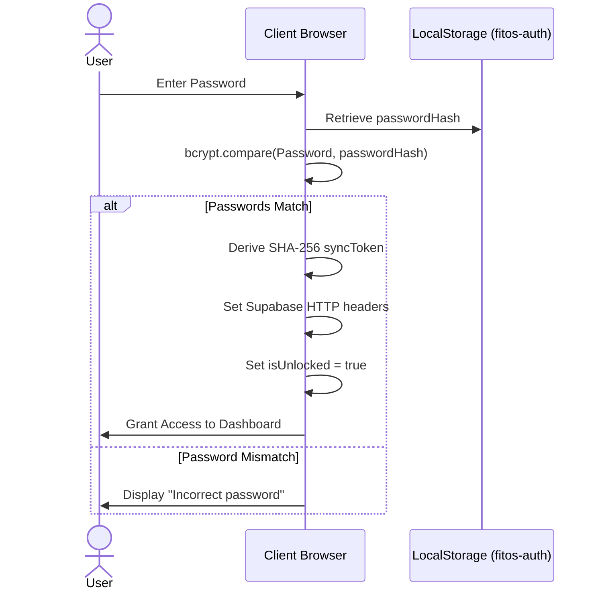
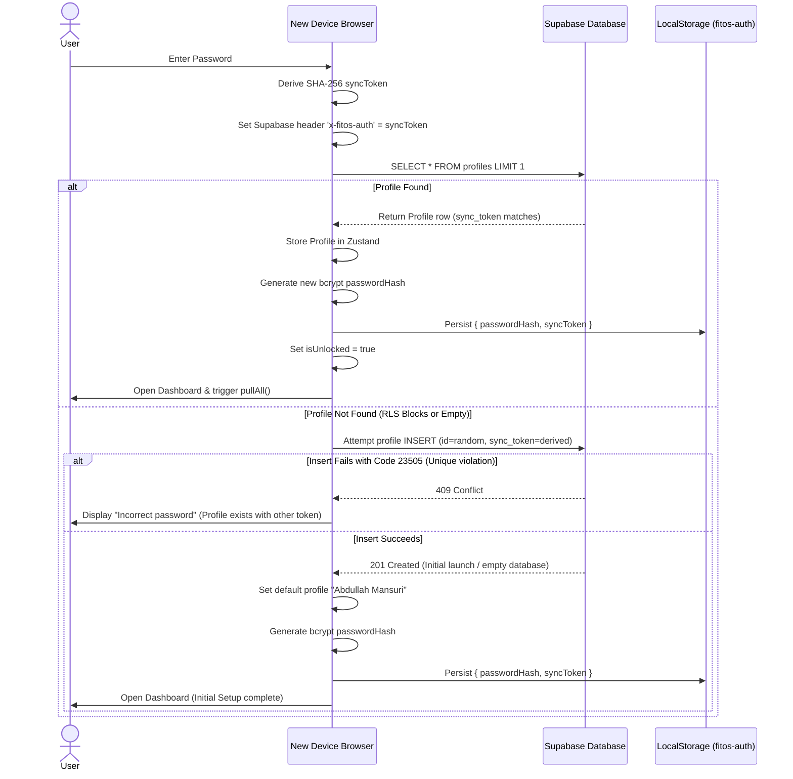

# Authentication and Security Specification

This document describes the cryptographic authentication model of FitOS, detailing lock screen mechanics, device pairing flows, password recovery, and the underlying security architecture.

---

## 1. Cryptographic Key Derivation

When the user sets up or enters their password, two distinct values are generated client-side:

1. **Password Hash (bcrypt)**:
   * Used strictly for local session lock validation.
   * Derived via `bcryptjs` with 10 salt rounds:
     $$\text{passwordHash} = \text{bcrypt}(\text{password}, 10)$$
   * Persisted in `localStorage` inside `fitos-auth`.
   
2. **Sync Token (SHA-256)**:
   * Used as the database access credential.
   * Derived via the browser's Web Crypto API using a static salt:
     $$\text{syncToken} = \text{SHA-256}(\text{password} + \text{"fitos-owner-salt-2026"})$$
   * Passed in the `x-fitos-auth` header for all REST queries to Supabase.
   * Persisted in `localStorage` inside `fitos-auth`.

---

## 2. Authentication Flow Diagrams

### Device Unlock (Local Persistence Present)



---

### New Device Pairing Flow

When pairing a new device (local storage empty):



---

## 3. Password Changes and Token Migration

### In-App Password Update
When updating the password in **Settings**:
1. User enters current password and new password.
2. App compares current password against the local `passwordHash` via `bcrypt`.
3. If valid, the new `syncToken` is derived from the new password.
4. The client executes an update to the database using the *current* token for RLS clearance:
   ```typescript
   supabase.from('profiles').update({ sync_token: newDerivedToken }).eq('id', profileId)
   ```
5. On success, the client updates `passwordHash` and `syncToken` in `localStorage` and updates HTTP headers.

### Legacy Token Migration
If an already logged-in device uses an old UUID-format token:
* Upon unlock, the client detects that `syncToken !== derivedToken`.
* It uses the old UUID `syncToken` to authorize an update query, writing the new SHA-256 `derivedToken` into the database.
* It then updates the local store to use the SHA-256 token permanently.

---

## 4. Recovery Flow

If the master password is forgotten, the user can reset the credentials using their **Recovery Phrase** (6 words):

1. The client retrieves the `recoveryHash` from local storage.
2. The user enters the recovery phrase.
3. The client compares the phrase against the hash via `bcrypt`.
4. If correct, the client derives the new `syncToken` from the new password.
5. It executes a profile update on Supabase using the *current* sync token to write the new token.
6. The client replaces the local `passwordHash` and `syncToken`.

---

## 5. Security Model & Risks

* **Zero-Knowledge Sync Token**: The server only knows the SHA-256 hash of the master password + salt. It cannot reverse this hash to recover the plaintext password.
* **Authentication Failure Modes**:
  * **Incorrect Password during Pairing**: The SELECT query returns `null` because RLS filters out rows where `get_auth_token() != sync_token`. The client falls back to an INSERT which triggers a database `23505` unique constraint violation because the single profile already exists, indicating the password was wrong.
  * **Database Offline**: If Supabase returns a network or query error other than `23505` during pairing, the app exposes the raw database error, preventing lockouts due to transient connectivity drops.
