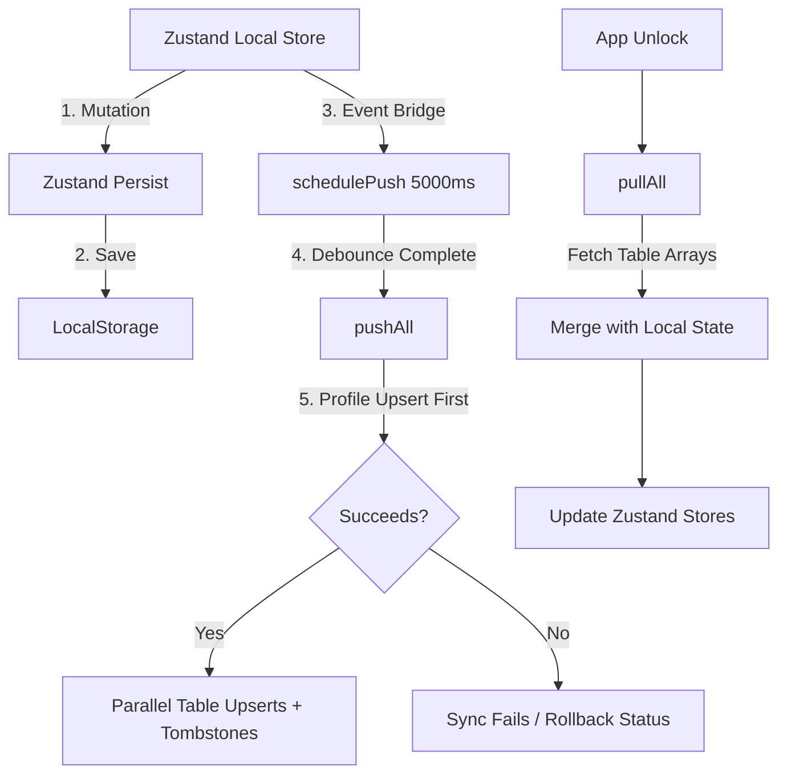

# Synchronization Engine Specification

This document details the bidirectional local-first synchronization engine of FitOS, explaining pull/push architectures, queue scheduling, tombstone handling, and offline behaviors.

---

## 1. High-Level Sync Flow

The synchronization layer mediates state transitions between the local Zustand memory cache and the remote Supabase database.



---

## 2. Push Architecture (`pushAll()`)

When a mutation occurs (log added, weight entered, template deleted), a push cycle is scheduled:

1. **Debounce Schedule**: `schedulePush(5000)` sets a 5-second timer. Subsequent mutations reset this timer to prevent excessive API requests.
2. **Execution Phase**:
   * **Profile Pre-Flight**: The profile is upserted sequentially first to establish the `sync_token` in the database and verify credentials:
     ```typescript
     await supabase.from('profiles').upsert({ ...profile, sync_token: syncToken })
     ```
   * **Parallel Upserts**: If the profile upsert succeeds, all other active tables (Goals, Weight Logs, Measurements, Food Logs, Workout Sessions, Exercises, Workout Templates, Memories) are upserted in parallel via `Promise.all()`.
   * **Tombstone Sync**: Deletions are processed synchronously. If a local tombstone array (e.g., `deletedExerciseIds`) is populated, a `DELETE` query is sent to Supabase. On success, the IDs are cleared from local storage.
   * **Sync Metadata**: Writes the current timestamp for each table to the `sync_metadata` table.

---

## 3. Pull Architecture (`pullAll()`)

On application startup, or when the user triggers a manual sync, `pullAll()` fetches all data tables from Supabase:

1. **Concurrent Fetches**: Queries all 9 target tables concurrently.
2. **Local Merging Rules**:
   * **Profile**: Overrides the local profile Zustand state with the database profile.
   * **Tombstones Guard**: Before loading records (e.g., goals, food logs), the client filters the fetched rows against the local `deleted<Entity>Ids` arrays. This ensures that records deleted offline are not resurrected by a pull cycle.
   * **Workout Templates & Exercises Merge**: To prevent seeded exercises or templates from being erased or duplicated, the client merges seeded templates/exercises, local custom elements (excluding legacy seed duplicates), and pulled database rows using a Map index to ensure uniqueness by ID.

---

## 4. Conflict Resolution & Offline Behavior

FitOS prioritizes local operations and uses a **Last-Write-Wins (LWW)** model for conflict resolution.

### Offline Behavior
1. If the app has no internet connection, `isSupabaseReachable()` returns `false`.
2. The sync engine halts sync and logs `Supabase unreachable — running offline`.
3. All user entries, edits, and deletions continue to save locally to `localStorage`.
4. Deletions are recorded in tombstone arrays.

### Reconnection and Recovery
1. When connectivity is restored, the next mutation schedules a push cycle, or the user can click **Pull** or **Push** in the status bar.
2. During `pushAll()`, all accumulated offline updates are upserted to Supabase.
3. Offline deletions are dispatched via `delete()` calls, purging the corresponding rows from Supabase.
4. The local tombstones are cleared, and the cloud database becomes fully synchronized.
